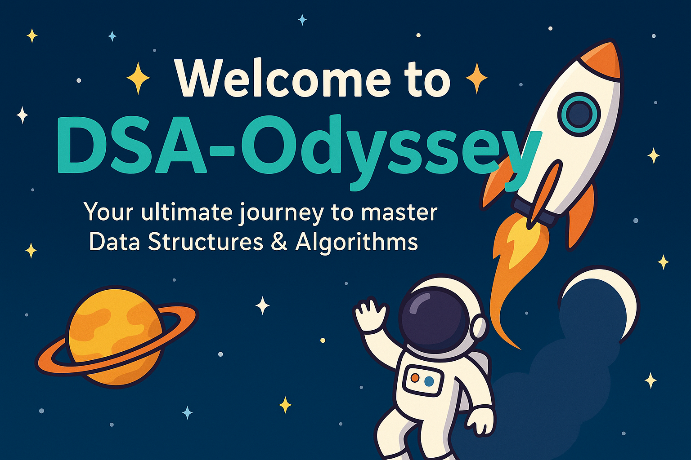

<h1 align="center">🚀✨ Welcome to <span style="color:#00C9A7;">DSA-Odyssey</span> ✨🚀</h1>

<p align="center">
  
</p>

<p align="center">
  Your ultimate journey to master <b>Data Structures & Algorithms</b> 💻💡  
  One problem at a time → From basics to advanced → With <b>C++ & Python</b> 🚀
</p>

---

## 📂 Repository Structure

```

DSA-Odyssey/
│
├── Arrays/
│   ├── two\_sum(1).readme
│   ├── max\_subarray(2).readme
│   └── ...
│
├── Strings/
│   ├── palindrome\_check(1).readme
│   └── ...
│
├── Binary Search/
│   ├── search\_in\_rotated\_array(1).readme
│   └── ...
│
└── ...

```

Each `question_name(number).readme` includes:  
✔️ Problem Link 🔗  
✔️ Problem Statement 📝  
✔️ Intuition 💭  
✔️ Approach ⚡  
✔️ Complexity Analysis ⏱️  
✔️ Solutions in **C++ & Python** 🖥️  
✔️ A motivational thought 💫  

---

## 🔥 Why This Repo?

✅ Well-structured & topic-wise categorized  
✅ Covers intuition + approach + code (C++ & Python)  
✅ Easy to revise before interviews  
✅ Designed like a *journey* (Odyssey 🌌) to keep you motivated  

---

## 📌 Categories Covered

- 🟢 [Arrays](./Arrays)  
- 🔵 [Strings](./Strings)  
- 🟣 [Binary Search](./Binary%20Search)  
- 🟡 [Dynamic Programming](./DP)  
- 🟠 [Graphs](./Graphs)  
- 🔴 [Trees](./Trees)  
- 🟤 [Linked List](./Linked%20List)  
- 🟢 [Recursion & Backtracking](./Recursion)  

---

## 🏆 How to Use This Repo?

1. Pick a topic 📂  
2. Choose a problem 📝  
3. Open its `.readme` file 📖  
4. Understand intuition → Learn approach → Check code (C++ & Python)  
5. End with a motivational thought 🌟  

---

## 💻 Languages Used

<p align="center">
  
</p>

---

## 🎯 Motivation Corner

> *"DSA is not about solving problems fast,  
> it’s about learning how to think better."* 🚀  

🌟 Keep grinding, stay consistent, and remember →  
**Every problem solved is a step closer to mastery.** 💪

---

<p align="center">
  Made with ❤️ and lots of ☕ by <b>Ayush</b>
</p>

---
